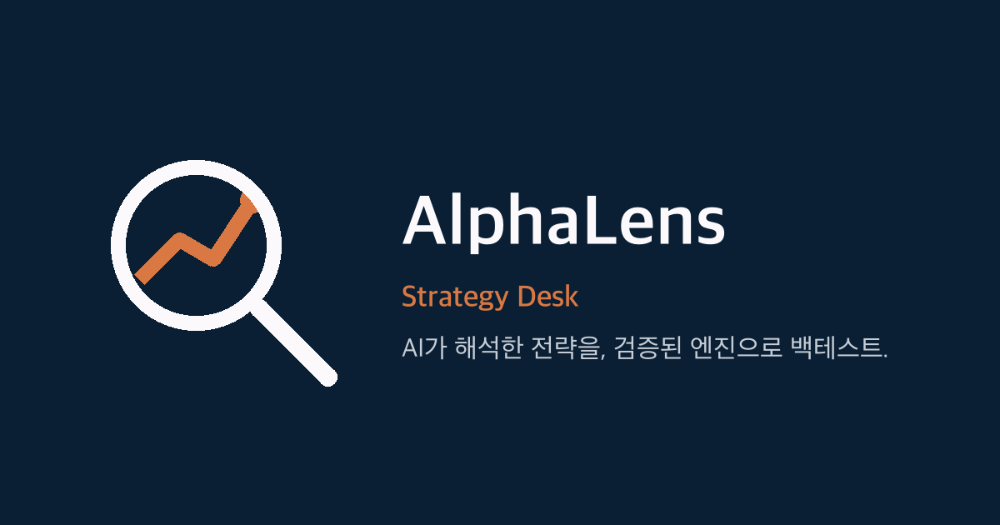

<p align="center">
  
</p>

<h1 align="center">AlphaLens</h1>
<p align="center"><strong>자연어로 설명한 투자 전략을 AI가 구조화하고, 검증된 엔진으로 백테스트하는 서비스</strong></p>

<p align="center">
  🔗 <a href="https://alphalens-cds.pages.dev">alphalens-cds.pages.dev</a> — 별도 설치 없이 바로 체험 가능합니다.
</p>

<p align="center">
  개인 프로젝트 · 기획 · 설계 · 개발 · 배포 · 운영 전 과정 단독 수행
</p>

---

## 한눈에 보기

"삼성전자를 20일선이 60일선을 골든크로스하면 사고, 데드크로스하면 팔아줘" 같은 문장을 입력하면:

1. AI가 이를 구조화된 전략(JSON)으로 변환
2. 누락값·가정값을 명시적으로 구분해 사용자에게 확인받고
3. 확정된 규칙만 **결정론적 Python 엔진**이 실제 시장 데이터로 계산해
4. 수익률·MDD·샤프지수 같은 성과지표, 거래 내역, AI의 결과 해설까지 제공합니다.

핵심은 **AI와 계산의 책임 분리**입니다. AI는 전략을 "해석"만 하고, 실제 수익률 계산은 AI가 절대 관여하지 않는 별도의 백테스트 엔진이 전담합니다 (AI가 생성한 코드를 실행하는 구조를 의도적으로 배제).

## 왜 만들었나

일반 투자자가 궁금해하는 건 대체로 복잡한 퀀트 이론이 아니라 "월요일에 사면 정말 손해일까?", "외국인 따라 사면 돈 벌까?" 같은 직관적인 투자 속설입니다. 이런 가설을 코드 한 줄 없이 채팅으로 검증할 수 있게 만드는 것이 목표입니다.

## 주요 기능

- **자연어 → 전략 변환**: OpenAI Structured Outputs로 자유 텍스트를 고정된 JSON Schema로 강제 변환 (환각으로 인한 스키마 이탈 원천 차단)
- **전략 유형**: 단일 종목 매매, 2자산 국면 전환, 다자산 목표비중 리밸런싱(조건부 포트폴리오 포함)
- **다양한 신호 지표**: 이동평균 교차, RSI, 거래량, 요일/월/연속 상승·하락일수 같은 캘린더 패턴, 원달러 환율·미국 금리·유가·VIX·나스닥 같은 매크로/해외지수까지 — 거래 종목과 다른 자산을 신호로 쓰는 교차자산 조건 지원
- **정확성 원칙**: 미래 데이터 참조 금지(신호는 종가, 체결은 다음날 시가), 전략/데이터/엔진 버전 고정으로 재현성 보장
- **운영 안정성**: 실행 실패 이력 기록, 동시 중복 실행 방지, 표준화된 오류 응답, 헬스체크, 요청 추적 로깅
- **전략 보관함**: 버전 관리, 결과 비교, 복제 후 재실행

## 기술 스택

| 영역 | 사용 기술 |
|---|---|
| Frontend | React, TypeScript, Vite |
| Backend | Python, FastAPI, Pydantic |
| AI | OpenAI API (Structured Outputs) |
| Backtest Engine | pandas, NumPy 기반 자체 구현 (외부 백테스트 라이브러리 미사용) |
| Database | PostgreSQL(Neon) / SQLite, Alembic 마이그레이션 |
| Market Data | yfinance(미국), pykrx(한국), CSV 업로드 |
| Deploy / CI | Cloudflare Pages, Render, GitHub Actions |
| Test | pytest 단위/통합 테스트 100개 이상 |

## 아키텍처

```
사용자 자연어 입력
  → AI 전략 해석 (Structured Outputs)
  → 전략 JSON 검증 (Pydantic Schema)
  → 사용자에게 가정값·누락값 구분해 표시
  → 사용자 최종 확인
  → 백테스트 엔진 실행 (AI 관여 없음)
  → 결과 저장 + AI 결과 해설 (계산된 수치만 설명)
```

절대 사용하지 않는 구조: `사용자 입력 → AI가 Python 코드 생성 → 생성된 코드 실행`
항상 사용하는 구조: `사용자 입력 → 제한된 Strategy JSON 생성 → Schema 검증 → 사용자 확인 → 사전 구현된 엔진 실행`

## 트러블슈팅 하이라이트

**1. 무료 데이터 소스의 이상치 대응**
한국 주식 데이터 공급원(`pykrx`)이 액면분할 등 기업행동 직후 거래정지일에 시가·고가·저가를 0으로 반환하는 사례를 실제 종목(삼성전자, 2018년 액면분할)으로 재현해 원인을 특정하고, 해당 행을 조회 단계에서 걸러내는 방어 로직을 추가했습니다.

**2. 외부 데이터 정책 변경 대응**
KRX가 정보데이터시스템을 로그인 필수 체계로 전면 개편한 사실을 조사로 확인하고, 영향받는 데이터 범위와 대안(공식 회원가입 경로)을 정리해 이후 기능 확장 계획에 반영했습니다.

**3. 교차자산 신호 아키텍처**
"코스피가 빠지면 삼성전자를 판다"처럼 신호 종목과 매매 종목이 다른 경우, 지표 계산이 조용히 잘못된 종목 데이터를 참조하지 않도록 조건마다 참조 종목을 명시할 수 있는 구조를 설계하고, 신호 종목별로 적합한 데이터 공급원을 자동 라우팅하도록 구현했습니다.

## 로컬 실행

```bash
# Backend
pip install -r requirements.txt
uvicorn services.api.app.main:app --reload

# Frontend
cd apps/web
npm install
npm run dev
```

`.env.example`을 참고해 `OPENAI_API_KEY` 등 환경변수를 설정하세요. DB는 `DATABASE_URL`을 지정하지 않으면 로컬 SQLite로 자동 동작합니다.

## 폴더 구조

```
apps/web/            # React + TypeScript 프론트엔드
services/api/app/     # FastAPI 백엔드
  ├── api/            # 라우트
  ├── schemas/         # Pydantic 스키마 (Strategy, Backtest 등)
  ├── services/         # 비즈니스 로직
  ├── backtest_engine/   # 계산 엔진 (지표, 신호, 체결, 성과지표)
  └── clients/           # OpenAI·시장데이터 외부 연동
migrations/           # Alembic 스키마 마이그레이션
tests/                # 단위/통합 테스트
```

## 더 자세한 개발 기록

Phase별 구현 이력, 전략 JSON 스키마, DB 설계, API 명세, 테스트 요구사항 등 세부 개발 문서는 [`docs/PROJECT_SPEC.md`](docs/PROJECT_SPEC.md)에서 확인할 수 있습니다.
